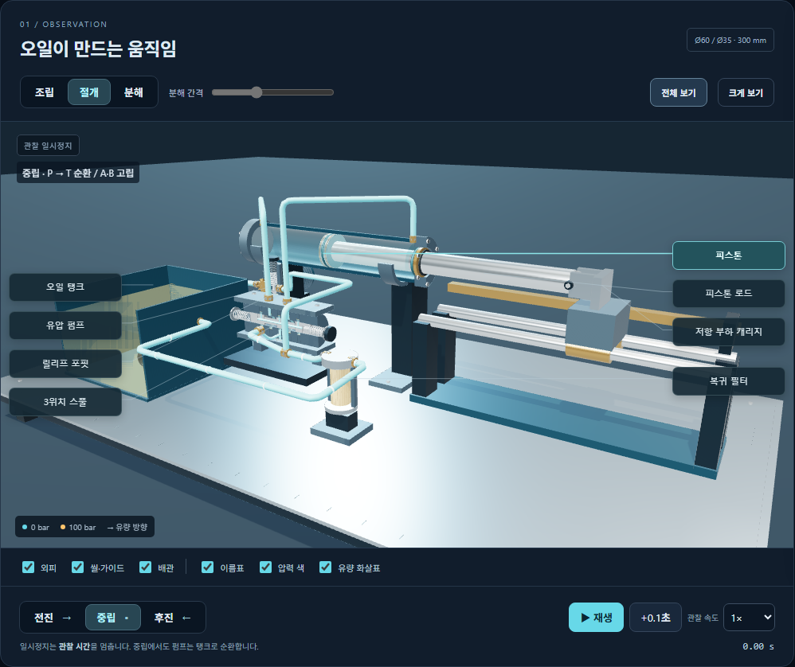
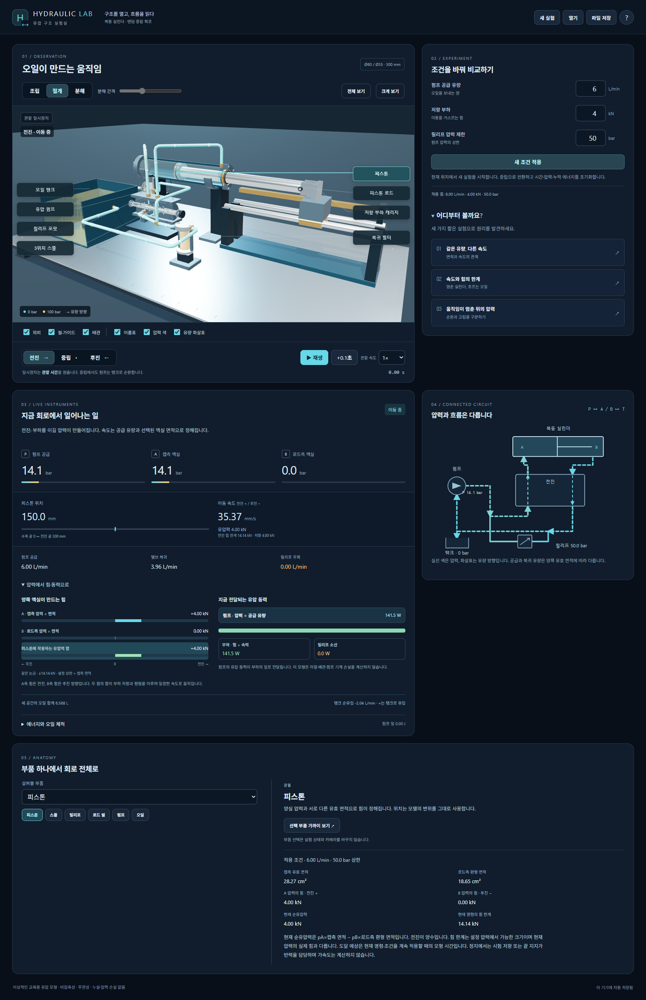
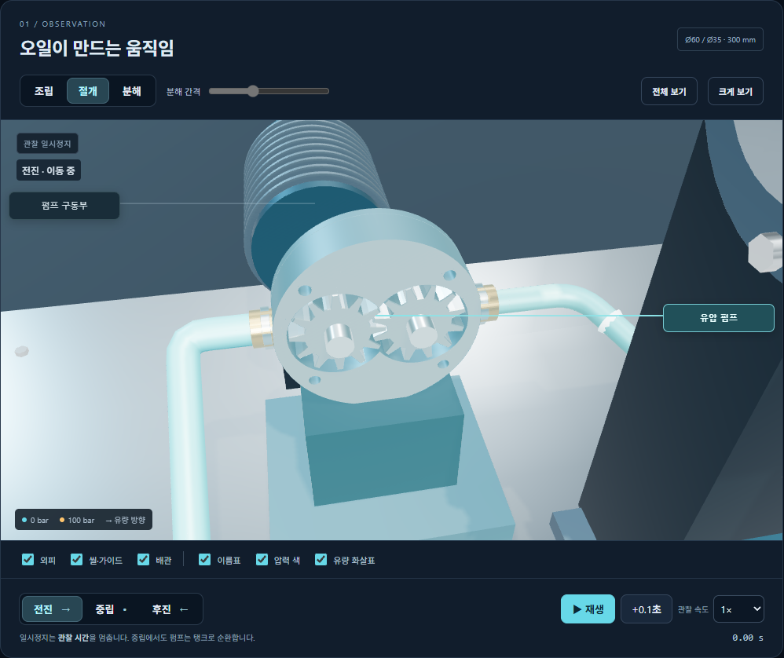
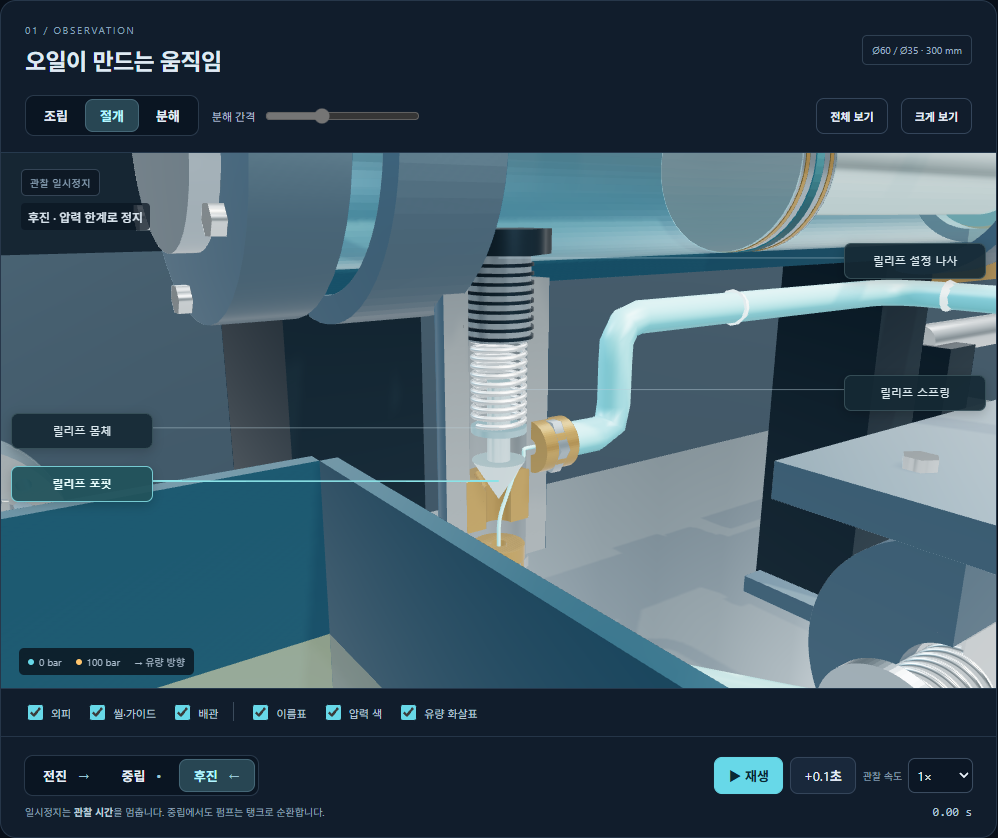

# Hydraulic Lab

복동 유압 실린더·방향제어 밸브·릴리프 밸브를 열어 보고 조작하는 한국어 Windows 시뮬레이터입니다. 같은 펌프 유량에서 전진과 후진의 속도가 다른 이유, 하중과 압력의 관계, 움직임이 멈춘 뒤에도 흐르거나 갇혀 있는 오일을 관찰합니다.

**[1.1.0 정식 릴리스](https://github.com/Ulsancl/hydraulic-lab/releases/tag/v1.1.0)**에서 설치파일과 변경·검증 결과를 확인하세요. 이전 1.0.0의 설치 검증 기록은 과거 기록이며, 1.1.0의 실제 설치·업데이트를 새로 실측했다는 뜻은 아닙니다.



34개 부품과 11개 배관 경로를 조립·절개·분해해 살펴봅니다. 부품 이름표는 수평을 유지하며, 3D 화면·회로도·계측판이 같은 계산 상태를 표시합니다. **색은 압력, 화살표는 유량 방향**입니다.

## 1.1.0 상세 관찰

부품을 선택하면 해당 위치의 압력·유량·체적·힘을 읽습니다. **압력에서 힘·동력으로**에서는 A측과 B측 힘의 방향 및 합, 부하에 전달되는 동력과 릴리프 소산을 함께 비교합니다. 수치와 막대는 현재 적용한 조건을 사용하며 편집 중인 입력 초안은 **새 조건 적용** 전까지 반영하지 않습니다.

**크게 보기**에서도 부품을 고르고 계산값을 펼칠 수 있습니다. 부품을 고르는 동작은 시점을 유지하고, **선택 부품 가까이 보기**는 관찰 시점을 바꿉니다. 이 시점은 기존 방식대로 실험 파일에 저장됩니다.

기어 펌프의 공동과 릴리프 접촉면도 실제 부품이 들어맞도록 보강했습니다. 펌프 가까이 보기에서는 두 기어와 공동을, 릴리프 절개에서는 닫힘 접촉면과 열린 틈을 확인할 수 있습니다. 계산은 기존 `hydraulic-quasistatic-1` 모형을 유지합니다. 중립의 잔압은 흐름이나 출력 동력이 아니며, 릴리프 소산을 온도로 바꾸지 않습니다. [상세 관찰과 검증 범위](docs/detail-refinement.md)를 참고하세요.







## 설치하고 시작하기

[1.1.0 릴리스](https://github.com/Ulsancl/hydraulic-lab/releases/tag/v1.1.0)의 Windows x64용 `Hydraulic-Lab-Setup-1.1.0.exe`를 실행하고, 바탕화면이나 시작 메뉴의 **Hydraulic Lab**을 엽니다. 설치본에는 실행 환경과 3D 자산이 포함되어 Node.js·별도 서버·인터넷 연결 없이 사용할 수 있습니다. WebGL2를 지원하는 그래픽 환경이 필요합니다. 실제 확인한 운영체제·화면 배율·그래픽 환경은 해당 릴리스의 검증 기록을 확인하세요.

설치파일과 앱에는 코드 서명이 없습니다. Windows가 게시자 또는 평판 경고를 표시할 수 있으므로 배포 출처와 함께 제공된 `.sha256`의 SHA-256 값을 확인하세요. 자동 업데이트는 없습니다. 실험 파일을 저장하고 앱을 닫은 뒤 새 설치파일을 실행해 수동으로 업데이트합니다. 자세한 설치·업데이트·제거 방법은 [Windows 사용 안내](docs/desktop.md)에 있습니다.

처음에는 다음 순서로 관찰하세요.

1. **같은 유량, 다른 속도** 실험을 선택하고 **재생**을 누릅니다. **전진**과 **후진**에서 속도와 양쪽 액실 면적을 비교합니다.
2. **중립**을 선택해 실린더는 멈추지만 P→T로 오일이 순환하는 것을 봅니다. 일시정지는 모형 시간 자체를 멈추는 기능입니다.
3. 관심 부품을 선택하고 **선택 부품 가까이 보기**로 안을 살펴봅니다. 화면 밖으로 나갔다면 **전체 보기**로 돌아옵니다.
4. **실험 저장**으로 관찰을 JSON 파일에 보관합니다. 다시 열면 같은 상태와 시점에서 일시정지 상태로 복원합니다.

[세 가지 체험 실험](docs/experiments.md)에서 비교할 값과 관찰 순서를 확인할 수 있습니다. **펌프 유량**은 실린더의 모형 속도를 바꾸고, **관찰 속도**는 화면에서 모형 시간이 흐르는 배율을 바꿉니다. 압력 제한 설정은 상한이며 평소 압력과 같다는 뜻은 아닙니다. 조건을 편집한 뒤 **새 조건 적용**을 누르면 같은 위치에서 시간·누적량이 0인 새 실험이 시작됩니다. 직전 실험은 현재 실행 세션에서 되돌릴 수 있습니다.

## 파일과 개인 데이터

실험 파일에는 설정·명령·위치·양실 압력·시간·누적 에너지·통과 체적·관찰 설정·카메라를 저장합니다. 학습 안내의 단계와 완료 결과는 현재 세션에서만 유지하며, 파일 열기·새 실험·앱 재시작 때 안내를 종료합니다. 직전 실험 되돌리기는 해당 세션의 안내 상태도 복구합니다.

파일 열기를 취소하거나 검증에 실패하면 현재 관찰을 유지합니다. 손상됐거나 더 새로운 버전의 자동 저장은 원문을 유지하고 자동 덮어쓰기를 멈춥니다. 화면의 **원문 내려받기**로 원문을 별도 파일에 보관하고, 현재 실험도 다른 파일로 저장하세요.

계정·클라우드 동기화·분석 통계 전송 기능은 없습니다. 자동 저장은 이 PC의 앱 저장 폴더에, 직접 저장한 JSON은 사용자가 고른 위치에 남습니다. 브라우저에서 개발판을 실행한 경우에는 해당 브라우저의 사이트 저장소를 사용합니다. [저장 위치와 개인정보](docs/privacy.md), [저장 형식](docs/storage.md)을 확인하세요.

## 모형의 범위와 지원

수평 저항 부하를 쓰는 비압축성·무관성·누설과 압력 손실이 없는 준정상 교육 모형입니다. 중력 하강, 압축성 과도응답, 발열·마모와 실제 장비의 안전성은 계산하지 않습니다. 분해 간격과 릴리프 포핏의 표시 움직임은 구조 관찰을 돕는 표현입니다. 실제 장비의 설계 승인·정비·부하 유지 안전성 판단에는 사용할 수 없습니다. [모형 가정](docs/model.md), [형상 설명](docs/anatomy.md), [참고 자료](docs/references.md)에 구체적인 범위를 기록했습니다.

문제가 있다면 앱 버전과 재현 순서를 기록해 배포 저장소의 Issues로 알려 주세요. 실험 파일과 화면은 내용을 확인한 뒤 선택적으로 첨부합니다. 유료 고객 지원이나 응답 시간은 약속하지 않으며, 판매·지원 조건은 별도 고지가 필요합니다. [문제 해결과 신고](docs/support.md), [공개 완료 기준과 검증 상태](docs/release-scope.md)를 확인하세요.

앱 자체의 라이선스는 **UNLICENSED**이며 소스 공개가 재배포·수정·판매 허가를 뜻하지 않습니다. [권리 고지](LICENSE.txt)와 [외부 소프트웨어 고지](docs/THIRD-PARTY-NOTICES.md)를 함께 확인하세요.

## 소스에서 실행·검사하기

Node.js 24.19에서 프로젝트 폴더 안에서 실행합니다.

```text
npm ci
npm run dev
```

개발 서버는 `http://127.0.0.1:5199`입니다. Windows 앱 실행은 `npm run desktop`, 설치파일 제작은 `npm run package:desktop`입니다. 제작 명령은 `release/windows/`에 설치파일과 SHA-256 파일을 만들며 공개 게시를 수행하지 않습니다.

```text
npm test
npm run build
npx --no-install playwright install chromium
npm run test:browser
npm run test:detail
node scripts/desktop.mjs prepare-test
npm run test:desktop
```

순수 검사는 모형·형상·저장·실험을, 브라우저와 Windows 검사는 실제 조작·파일 보호·복원을 다룹니다. 앱 검사는 합성 파일과 별도 프로필을 사용합니다. CI는 Windows에서 순수 검사·빌드·브라우저·소스 앱·패키지 앱을 검사하고 설치파일과 진단 자료를 보관합니다. GitHub Release 게시는 자동으로 수행하지 않습니다.
